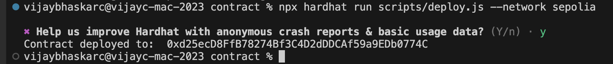
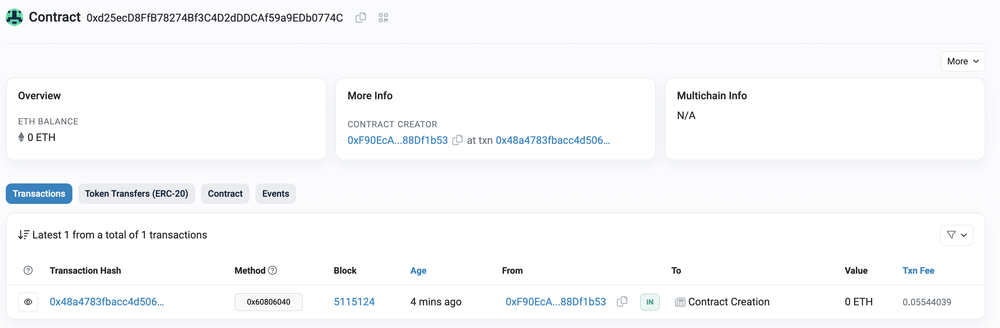
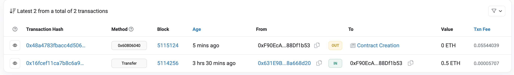
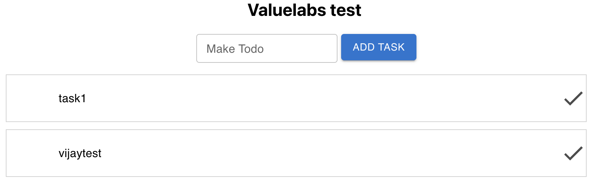

To run the ethereum testnet server update the .env file with testnetwork URL and user private key

Install node modules by command
`npm install`

### Test cases
To run test cases 
`npx hardhat test`

### Contract deployment
To deploy to the test network

`npx hardhat run scripts/deploy.js --network sepolia`

The below is the smart contract deployed
https://sepolia.etherscan.io/address/0xd25ecD8FfB78274Bf3C4D2dDDCAf59a9EDb0774C

### Ether scan
Here is the below transactions history
https://sepolia.etherscan.io/address/0xF90EcA0f0902EcdE04d6A45894442e2188Df1b53

### Output

Here is the output screen

